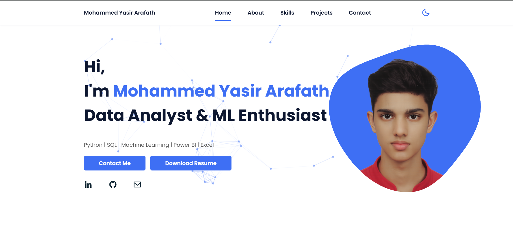

# 👨‍💻 Mohammed Yasir Arafath

### Data Analyst | Machine Learning Enthusiast

Welcome to my **personal portfolio repository**.
This portfolio highlights my **data analytics, machine learning, and visualization projects** along with my technical skills.

---

## 🌐 Live Portfolio

🔗 **View Website**
https://yasirpt07.github.io/Mohammed-Yasir-Arafath-portfolio/

---

## 📊 About Me

I am a passionate **Data Analyst** who enjoys transforming raw data into meaningful insights.

My goal is to help organizations make **data-driven decisions** using analytics, visualization, and machine learning.

---

## 🧠 Skills

### Programming & Data

### Data Visualization

### Web

---

## 📂 Portfolio Sections

The portfolio website contains:

* 🏠 **Home** – Introduction and professional overview
* 👨‍💻 **About** – Background and career interests
* 🧠 **Skills** – Technical tools and technologies
* 📊 **Projects** – Data analytics and ML projects
* 📬 **Contact** – Direct contact form

---

## 🚀 Featured Projects

### 📈 SaaS Customer Intelligence Platform

**Tools:** Python, SQL, Machine Learning, Excel
A platform that analyzes SaaS customer data and produces actionable insights.

---

### 🏦 Bank Customer Churn Prediction

**Tools:** Python, Machine Learning
Predicts which customers are likely to leave a bank.

---

### 👥 Customer Segmentation

**Tools:** Python, K-Means Clustering
Segments customers based on behavior and demographics.

---

## 📸 Portfolio Preview

---

## 📬 Contact

[📧 Email](yasirpt77@gmail.com)
[💼 LinkedIn](https://www.linkedin.com/in/mohammed-yasir-arafath-pt/)
[💻 GitHub](https://github.com/yasirpt07)

---

## 📊 GitHub Stats

---

## 🔥 GitHub Streak

---

## ⭐ Support

If you like this portfolio, please consider **starring the repository**.

It helps others discover the project.
